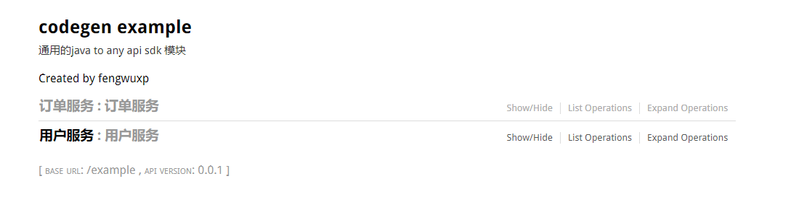
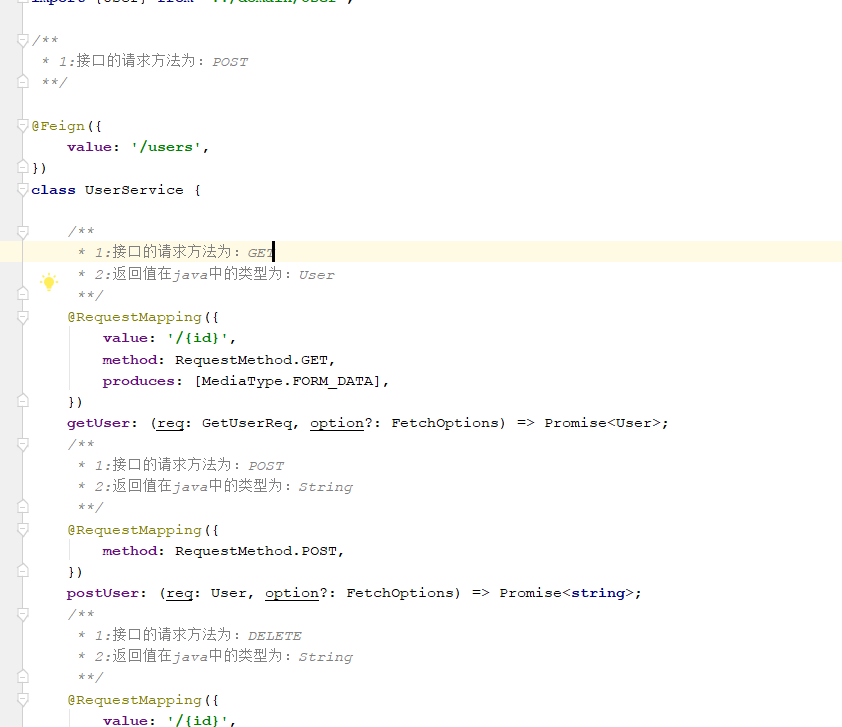
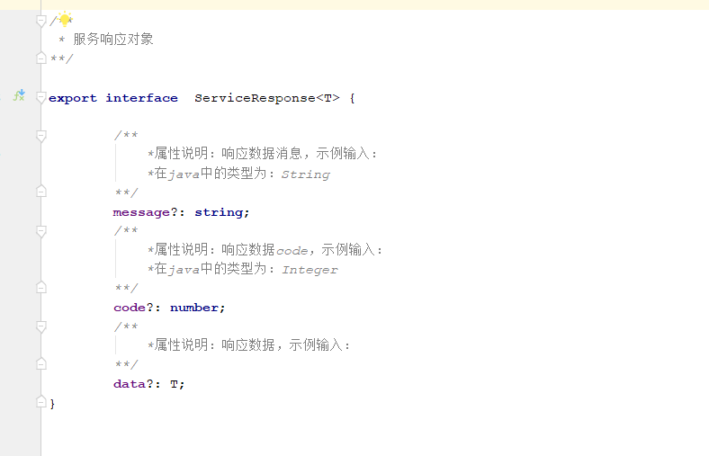

#### 代码生成流程简述

- 1.配置java和目标语言的基础类型映射关系，以及自定义
- 2.设置需要包名映射关系，将java包名转换为目标语言的包名或目录路径
- 3.实例化要生成的目标语言的解析器，包名映射策略，模板加载
- 4.通过第三方实例化的对象，构造代码生成器

- 具体可以参考[SwaggerCodegenTypescriptTest](../example/swagger-2/src/test/java/test/com/wuxp/codegen/typescript/SwaggerCodegenTypescriptTest.java)

##### 生成过程截图

  <h1>swagger-2的文档页面</h1>
  
  
  <h1>生成的结果(typescript)</h1>
  
控制器生成的结果

  
   
请求对象或方法参数生成的结果

  
   
响应对象

  
  
统一响应对象

  
  
枚举

  

